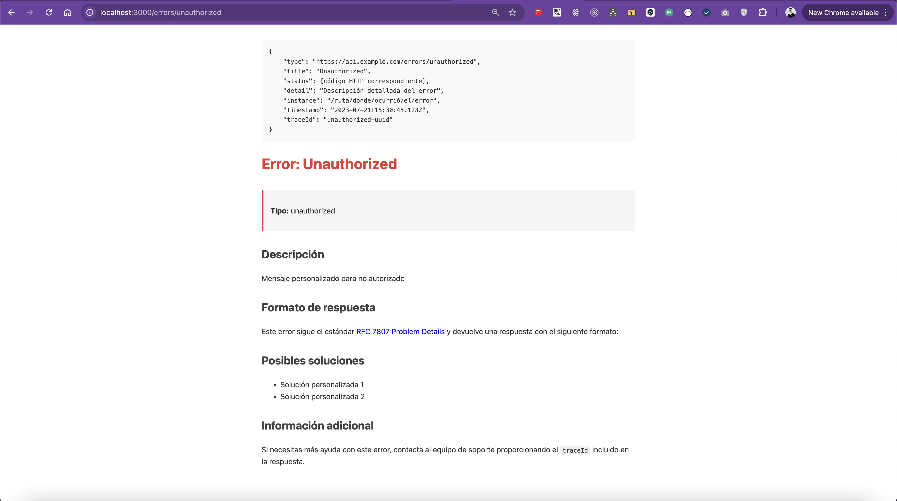

# Módulo Error Manager

### @nest-js/error-manager

[](https://www.npmjs.com/package/@nest-js/error-manager)
[](https://opensource.org/licenses/MIT)


El módulo Error Manager implementa el estándar [RFC 7807 Problem Details](https://datatracker.ietf.org/doc/html/rfc7807) para el manejo uniforme de errores en APIs HTTP. Este estándar proporciona una forma estructurada y consistente de devolver información de error a los clientes, facilitando el diagnóstico y la resolución de problemas.

#### Características principales

- Implementación completa del estándar RFC 7807 Problem Details
- Generación automática de IDs de rastreo (traceId) para cada error
- Páginas HTML de documentación para cada tipo de error
- Filtro global para capturar y transformar todas las excepciones
- Integración con el sistema de logging

# Uso

### Importación del módulo

El módulo está marcado como `@Global()`, por lo que solo necesitas importarlo una vez en el módulo raíz de tu aplicación:

```typescript
import { ErrorManagerModule } from './app/error-manager/error-manager.module';

@Module({
    imports: [ErrorManagerModule.forRoot({
        descriptions: {
            unauthorized: 'Mensaje personalizado para no autorizado',
            // ... otros mensajes
        },
        solutions: {
            unauthorized: [
                'Solución personalizada 1',
                'Solución personalizada 2'
            ],
            // ... otras soluciones
        }
    })],
})
export class AppModule { }
```
#### Ejemplo de Html Autogenerado



### Acceder a la documentación de errores

La documentación HTML para cada tipo de error está disponible en:

```
GET /errors/:errorType
```

Por ejemplo: `/errors/unauthorized` mostrará la documentación para errores de tipo "unauthorized".

## Beneficios

- **Consistencia**: Todas las respuestas de error siguen el mismo formato
- **Trazabilidad**: Cada error tiene un ID único para facilitar su seguimiento
- **Documentación**: Páginas HTML automáticas para cada tipo de error
- **Cumplimiento de estándares**: Implementación del RFC 7807 ampliamente adoptado
- **Facilidad de depuración**: Información detallada para desarrolladores y usuarios

## Campos

- **type**: URI que identifica el tipo de problema y apunta a la documentación HTML
- **title**: Resumen breve y legible del problema
- **status**: Código de estado HTTP
- **detail**: Explicación detallada del problema
- **instance**: URI que identifica la instancia específica del problema
- **timestamp**: Marca de tiempo cuando ocurrió el error
- **traceId**: Identificador único de rastreo para el error
- **errors**: Detalles adicionales sobre errores específicos (ej. errores de validación)